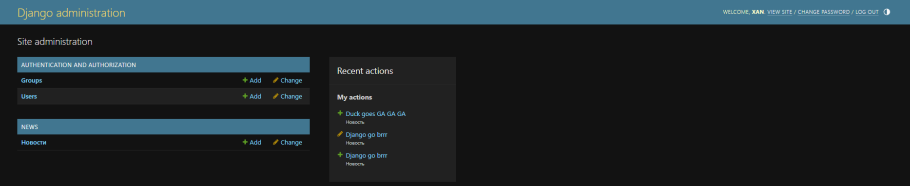
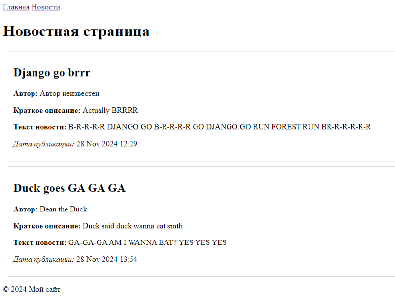

#### В данном репозитории содержится:
* Проект Django с именем myproject
* **Создано приложение news для публикации новостей**
* **Создана базовая структура шаблонов - layouts.html и news.html** 
* **Создана модель new_post для новостей в models.py** (зарегистрирована в admin.py)
  * title — название новости
  * short_description — краткое описание
  * text — полный текст
  * pub_date — дата публикации
  * author — имя автора новости
* **views.py настроен для получения данных из модели**
* **Созданы миграции для модели new_post**
* **Создана админ-панель для работы с новостями**
###### (Для запуска проекта откройте терминал и выполните команду: python manage.py runserver)

