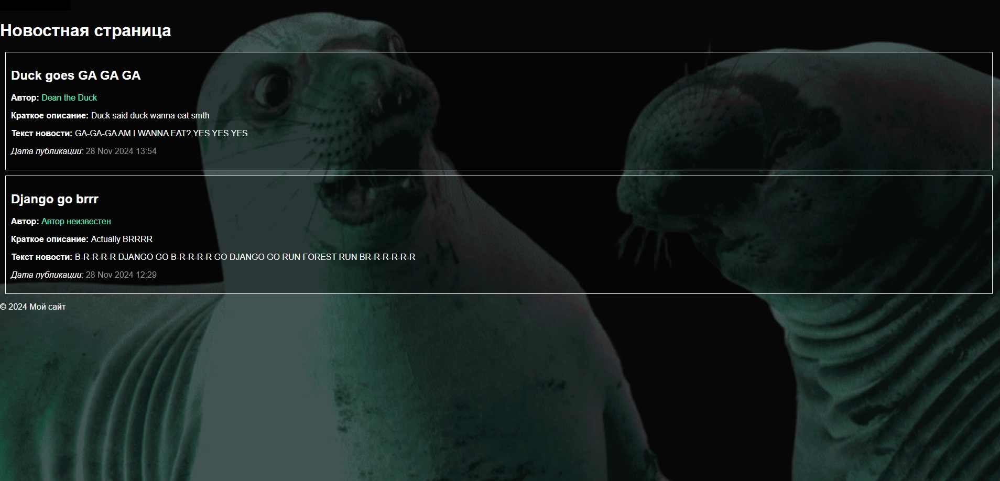

<!-- Improved compatibility of В начало link: See: https://github.com/othneildrew/Best-README-Template/pull/73 -->
<a id="readme-top"></a>


<!-- LANGUAGE SWITCHER -->
<div align="right">
  <strong>Язык:</strong> <a href="README.en.md">English</a> | <a href="README.md">Русский</a>
</div>


<!-- PROJECT SHIELDS -->
<!--
*** I'm using markdown "reference style" links for readability.
*** Reference links are enclosed in brackets [ ] instead of parentheses ( ).
*** See the bottom of this document for the declaration of the reference variables
*** for contributors-url, forks-url, etc. This is an optional, concise syntax you may use.
*** https://www.markdownguide.org/basic-syntax/#reference-style-links
-->


<!-- PROJECT LOGO -->
<br />
<div align="center">
  <h1 align="center">Conceptual News Django</h3>

  <p align="center">
    Простое Django приложение для публикации новостей
    <br />
  </p>
</div>


<!-- TABLE OF CONTENTS -->
<details>
  <summary>Содержание</summary>
  <ol>
    <li>
      <a href="#о-проекте">О проекте</a>
      <ul>
        <li><a href="#используемые-технологии">Используемые технологии</a></li>
      </ul>
    </li>
    <li>
      <a href="#начало-работы">Начало работы</a>
      <ul>
        <li><a href="#требования">Требования</a></li>
        <li><a href="#установка">Установка</a></li>
      </ul>
    </li>
    <li><a href="#использование">Использование</a></li>
    <li><a href="#план-развития">План развития</a></li>
    <li><a href="#вклад-в-проект">Вклад в проект</a></li>
    <li><a href="#лицензия">Лицензия</a></li>
    <li><a href="#контакты">Контакты</a></li>
    <li><a href="#благодарности">Благодарности</a></li>
  </ol>
</details>


<!-- ABOUT THE PROJECT -->
## О проекте




Conceptual News Django - это простое веб-приложение на Django для публикации и отображения новостей. Проект демонстрирует базовую функциональность работы с моделями данных, представлениями и шаблонами с использованием Django framework.

<details>
  <summary><strong>Цели и задачи проекта</strong></summary>

**Цели:**
* Создать простое и функциональное веб-приложение для публикации новостей
* Продемонстрировать базовые возможности Django framework
* Реализовать систему отображения новостей с информацией об авторе и дате публикации
* Настроить админ-панель для управления новостями

**Ключевые задачи:**
* Разработать модель данных для хранения информации о новостях
* Создать пользовательский интерфейс для просмотра новостей
* Настроить админ-панель для управления данными
* Реализовать базовую структуру шаблонов с наследованием
* Настроить статические файлы и стили

</details>

<details>
  <summary><strong>Результаты</strong></summary>

**Реализованная функциональность:**
* Просмотр списка новостей (доступно всем пользователям)
* Отображение полной информации о новостях: заголовок, автор, краткое описание, текст и дата публикации
* Админ-панель для управления новостями
* Базовый шаблон с навигацией и стилизацией

**Созданные компоненты:**
* Django приложение `news` для работы с новостями
* Модель `News_post` с полями: название, краткое описание, текст, дата публикации и автор
* HTML страницы: список новостей с базовым шаблоном
* Статические файлы (CSS, изображения) для стилизации

</details>

<p align="right">(<a href="#readme-top">В начало</a>)</p>


### Используемые технологии

Основные технологии и библиотеки, используемые в проекте:

* [![Django][Django-badge]][Django-url]
* [![Python][Python-badge]][Python-url]

<p align="right">(<a href="#readme-top">В начало</a>)</p>


<!-- GETTING STARTED -->
<details>
  <summary><strong>Начало работы</strong></summary>

Инструкции по установке и запуску проекта локально.

### Требования

Для работы с проектом необходимо установить:

* Python 3.x
  ```sh
  # Проверьте версию Python
  python --version
  ```

### Установка

Ниже приведены инструкции по установке и настройке приложения.

1. Клонируйте репозиторий
   ```sh
   git clone https://github.com/your_username/repo_name.git
   cd The-simplest-Django-case
   ```

2. Создайте виртуальное окружение (рекомендуется)
   ```sh
   python -m venv venv
   # Windows
   venv\Scripts\activate
   # Linux/Mac
   source venv/bin/activate
   ```

3. Установите зависимости
   ```sh
   pip install -r requirements.txt
   ```

4. Примените миграции
   ```sh
   python manage.py migrate
   ```

5. Создайте суперпользователя для доступа к админ-панели
   ```sh
   python manage.py createsuperuser
   ```

6. Запустите сервер разработки
   ```sh
   python manage.py runserver
   ```

7. Откройте в браузере:
   - Главная страница: http://127.0.0.1:8000/news/
   - Админ-панель: http://127.0.0.1:8000/admin/

</details>

<p align="right">(<a href="#readme-top">В начало</a>)</p>


<!-- USAGE EXAMPLES -->
<details>
  <summary><strong>Использование</strong></summary>

Приложение предоставляет следующие страницы и функциональность:

### Основные страницы:

1. **Список новостей** (`/news/`)
   - Отображает все новости из базы данных
   - Доступна всем пользователям без авторизации
   - Показывает заголовок, автора, краткое описание, полный текст и дату публикации для каждой новости
   - Новости отсортированы по дате публикации (сначала новые)

2. **Админ-панель** (`/admin/`)
   - Стандартная Django админ-панель
   - Полный доступ к управлению новостями
   - Фильтрация по дате публикации и автору
   - Поиск по заголовку, краткому описанию, тексту и автору
   - Иерархия по датам для удобной навигации

### Особенности:

- Темный дизайн с фоновым изображением
- Адаптивная верстка
- Удобная навигация между страницами
- Информативное отображение дат публикации

</details>

<p align="right">(<a href="#readme-top">В начало</a>)</p>


<!-- ROADMAP -->
## План развития

<details>
  <summary><strong>Показать пройденные этапы разработки</strong></summary>

### Выполненные этапы:

- [x] **Этап 1: Базовая структура проекта**
  - [x] Создание Django проекта `myproject`
  - [x] Создание приложения `news`
  - [x] Настройка базовой структуры URL и маршрутизации

- [x] **Этап 2: Модель данных**
  - [x] Разработка модели `News_post` с полями: название, краткое описание, текст, дата публикации
  - [x] Создание и применение миграций базы данных
  - [x] Добавление поля `author` для указания автора новости
  - [x] Настройка сортировки по дате публикации (сначала новые)

- [x] **Этап 3: Базовые представления и шаблоны**
  - [x] Реализация представления для отображения списка новостей
  - [x] Создание HTML шаблонов для списка новостей (`news.html`)
  - [x] Настройка базового шаблона с навигацией (`layout.html`)
  - [x] Реализация наследования шаблонов

- [x] **Этап 4: Админ-панель**
  - [x] Настройка Django админ-панели для модели News_post
  - [x] Добавление фильтров по дате публикации и автору
  - [x] Реализация поиска по заголовку, краткому описанию, тексту и автору
  - [x] Настройка иерархии по датам для удобной навигации
  - [x] Настройка отображения полей в списке новостей

- [x] **Этап 5: Статические файлы и стилизация**
  - [x] Настройка статических файлов в settings.py
  - [x] Создание CSS файла для стилизации страниц
  - [x] Реализация темного дизайна с фоновым изображением
  - [x] Стилизация новостных блоков и элементов интерфейса

- [x] **Этап 6: Локализация**
  - [x] Настройка русского языка для моделей
  - [x] Перевод названий полей моделей на русский
  - [x] Русские названия в админ-панели

- [x] **Этап 7: URL маршрутизация**
  - [x] Настройка корневого URL файла с редиректом на новости
  - [x] Создание URL конфигурации для приложения news
  - [x] Настройка именованных URL для навигации

</details>

### Планируемые улучшения:

- [ ] Система аутентификации пользователей
- [ ] Форма добавления/редактирования новостей через веб-интерфейс
- [ ] Пагинация для списка новостей
- [ ] Детальная страница новости
- [ ] Категории новостей
- [ ] Теги для новостей
- [ ] Поиск по новостям на странице
- [ ] Комментарии к новостям
- [ ] Загрузка изображений для новостей
- [ ] RSS-лента новостей
- [ ] API endpoints (REST API)
- [ ] Unit-тесты
- [ ] CI/CD pipeline
- [ ] Улучшение дизайна и адаптивности

<p align="right">(<a href="#readme-top">В начало</a>)</p>


<!-- CONTRIBUTING -->
## Вклад в проект

Вклады делают сообщество открытого исходного кода таким удивительным местом для обучения, вдохновения и творчества. Любые ваши вклады будут **высоко оценены**.

Если у вас есть предложения по улучшению, пожалуйста, создайте fork репозитория и отправьте pull request. Вы также можете просто открыть задачу с тегом «enhancement». Не забудьте поставить проекту звездочку! Еще раз спасибо!

1. Создать fork проекта
2. Создайте ветку для вашей функции (`git checkout -b feature/AmazingFeature`)
3. Зафиксируйте изменения (`git commit -m 'Add some AmazingFeature'`)
4. Отправьте изменения в ветку (`git push origin feature/AmazingFeature`)
5. Создайте Pull Request

<p align="right">(<a href="#readme-top">В начало</a>)</p>


<!-- LICENSE -->
## Лицензия

Распространяется по лицензии MIT. Дополнительную информацию см. в файле `LICENSE`.

<p align="right">(<a href="#readme-top">В начало</a>)</p>


<!-- CONTACT -->
## Контакты

* [![GitHub][GitHub-badge]][GitHub-url]
* [![Gmail][Gmail-badge]][Gmail-url]
* [![Telegram][Telegram-badge]][Telegram-url]

<p align="right">(<a href="#readme-top">В начало</a>)</p>


<!-- ACKNOWLEDGMENTS -->
## Благодарности

Выражаю искреннюю благодарность университету [Zerocoder](https://zerocoder.ru/) и всей его команде за создание вдохновляющей и профессиональной образовательной среды. За подготовку "IT-астронавтов" на "космодроме" Зерокодер.

Особая благодарность:

[Кириллу Пшиннику](https://kpshinnik.ru/), директору университета, за вдохновение на подвиг;

Преподавателям [Нине Стефанцовой](https://neural-courses.ru/teacher/nina-stefancova/), [Максиму Вершинину](https://neural-courses.ru/teacher/maksim-vershinin/) и [Дарье Бобровской](https://neural-courses.ru/teacher/darya-bobrovskaya/) — за глубокие знания, терпение и готовность всегда помочь;

Никите Муркину, куратору курса, за чёткую организацию и наставничество;

Елизавете, менеджеру, за заботу, оперативность и неизменную доброжелательность.

Благодаря вам этот проект стал возможен!

<p align="right">(<a href="#readme-top">В начало</a>)</p>


<!-- MARKDOWN LINKS & IMAGES -->
<!-- https://www.markdownguide.org/basic-syntax/#reference-style-links -->
[Django-badge]: https://img.shields.io/badge/Django-092E20?style=for-the-badge&logo=django&logoColor=white
[Django-url]: https://www.djangoproject.com/
[Python-badge]: https://img.shields.io/badge/Python-3776AB?style=for-the-badge&logo=python&logoColor=white
[Python-url]: https://www.python.org/
[GitHub-badge]: https://img.shields.io/badge/GitHub-181717?style=for-the-badge&logo=github&logoColor=white
[GitHub-url]: https://github.com/Z01coder
[Gmail-badge]: https://img.shields.io/badge/Gmail-D14836?style=for-the-badge&logo=gmail&logoColor=white
[Gmail-url]: mailto:zolotuxin.alexey@gmail.com
[Telegram-badge]: https://img.shields.io/badge/Telegram-2CA5E0?style=for-the-badge&logo=telegram&logoColor=white
[Telegram-url]: https://t.me/AZVXAN
